# Rest-API-Development_P07_Latihan&Tugas
**Nama: Jenie Josphin** 
**NIM: 23100016** 
**Mata Kuliah: Pemrograman Berorientasi Objek 2** 
**Kelas: STI-Pagi**  

# **_Latihan 04 - API Latihan 03_**
### 1. Get Book
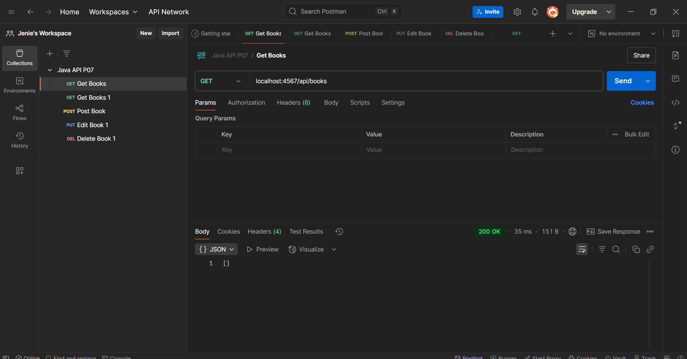

### 2. Get Book 1
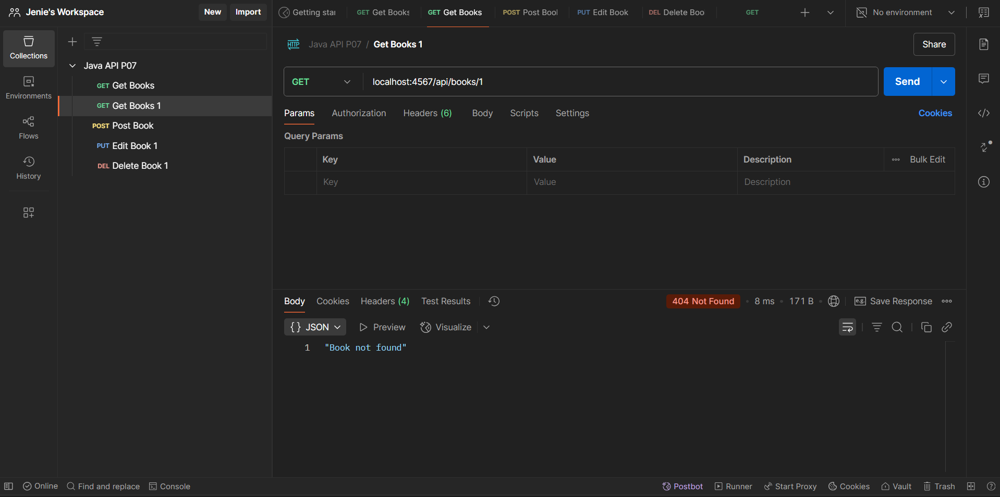

### 3. Post Book (Input)
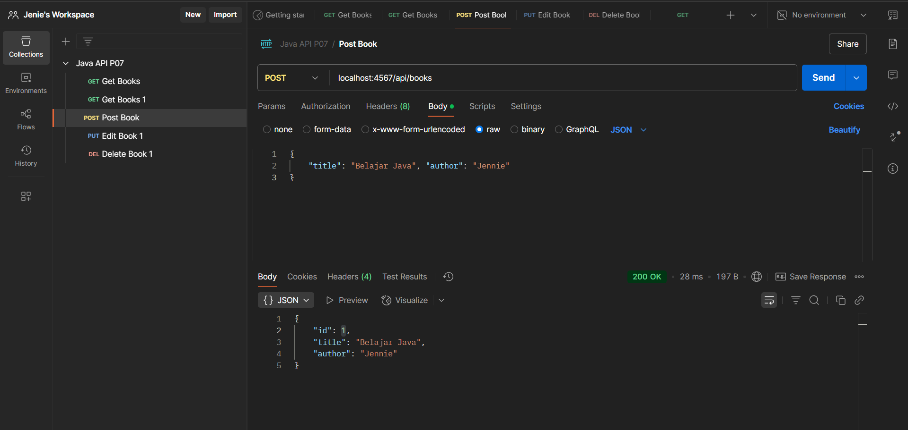

### 4. Put Book (Edit)

### 5. Delete Book (Hapus)
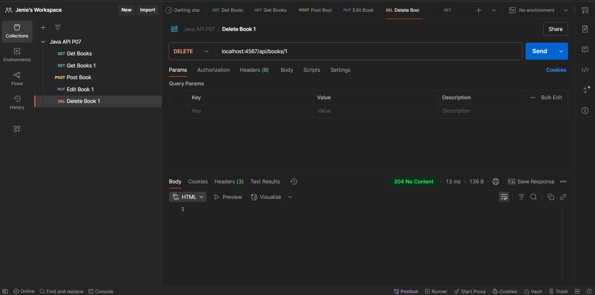  

# **_Latihan 05 - Menampilkan tampilan GUI - menambahkan data di Postman_**
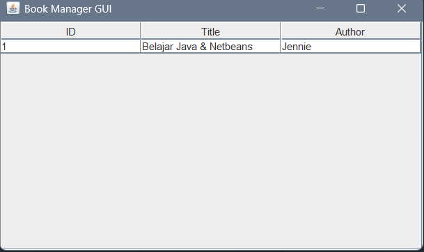  

# **_Latihan 06 - Tombol Refresh_**
### 1. Get Book - Sebelum meng-input data
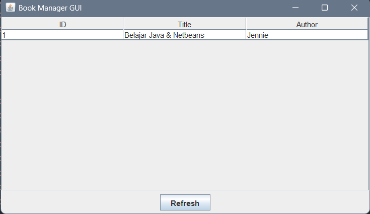

### 2. Get Book - Setelah input data dan melakukan Refresh di-GUI
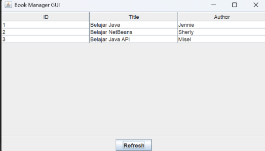  

# **_Latihan 07 - Input data di GUI_**
### 1. Tampilan GUI - Sebelum meng-input data

### 2. Tampilan GUI - Input data di GUI
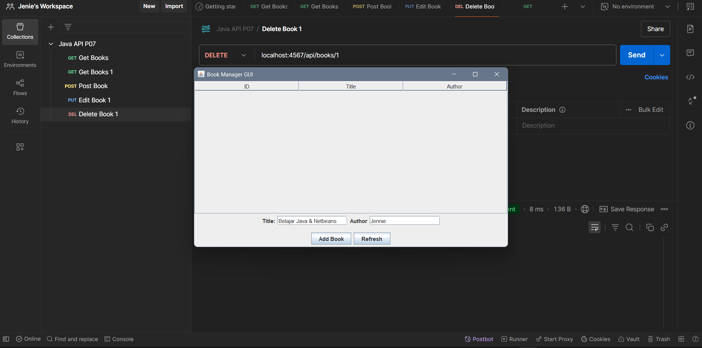

### 3. Get Books - Setelah data berhasill ditambahkan dari GUI
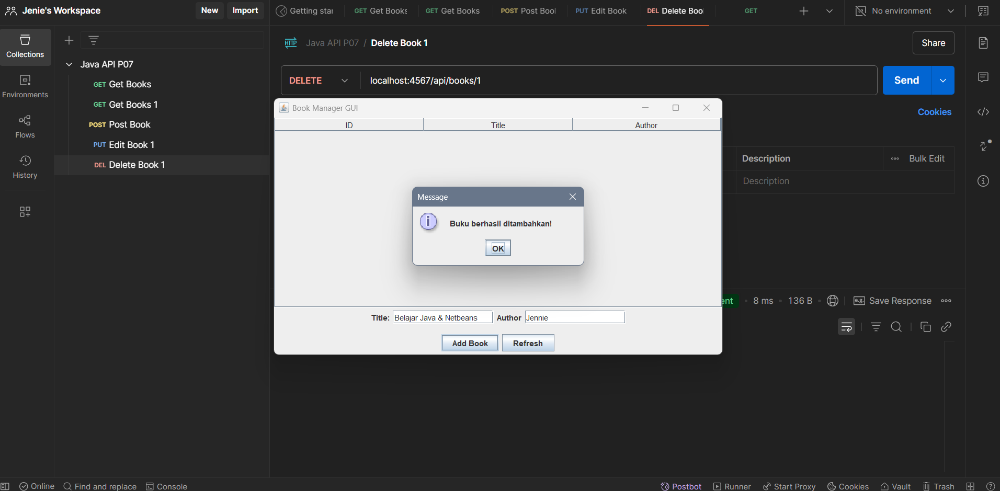

### 4. Get Books - Setelah data ditambahkan dari GUI
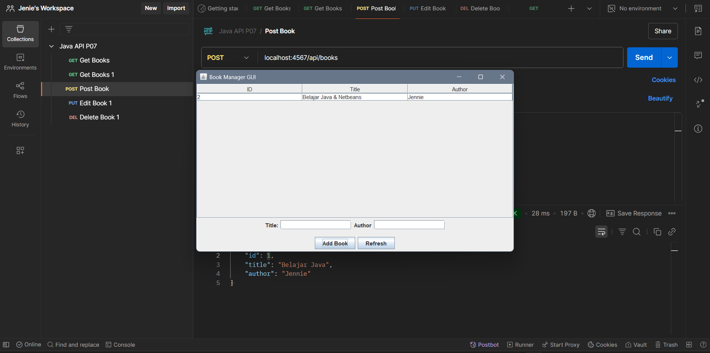  

# **_TUGAS - Edit dan Delete_**
### 1. Tampilan GUI - Semua data telah di-input
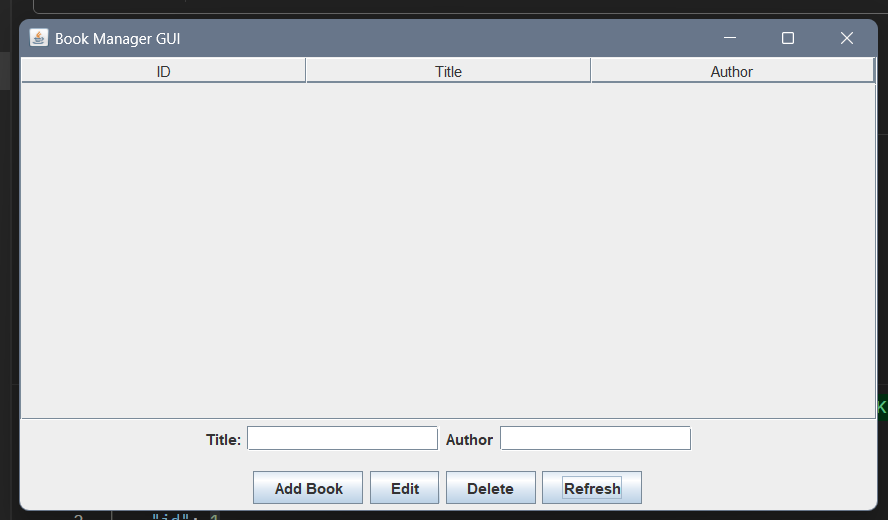

### 2. Get Books - Menambahkan Data
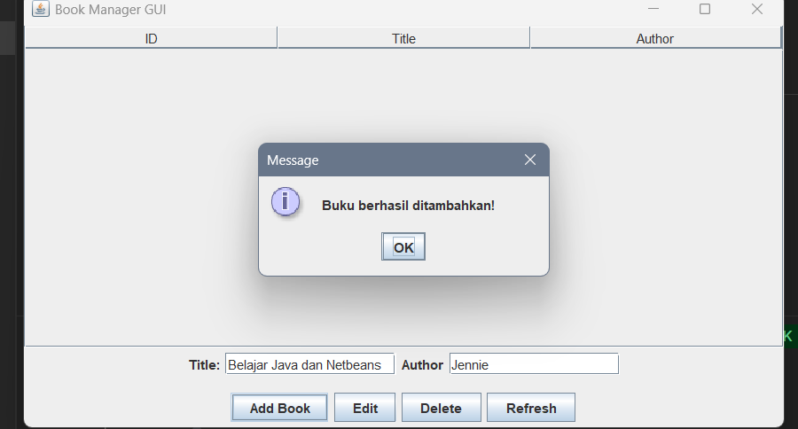

### 3. Edit Book - Mengedit data dan tombol Edit untuk save perubahan
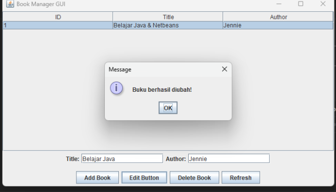

### 4. Tampilan GUI Setelah Edit Book
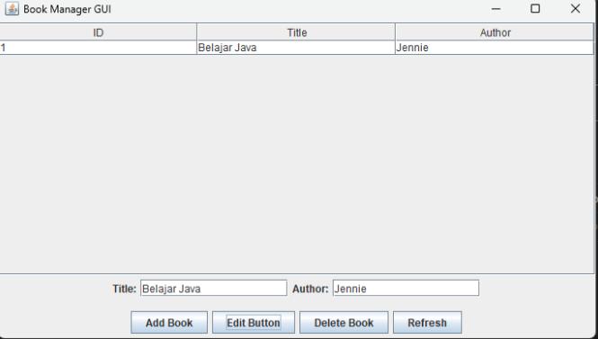

### 5. Tampilan Delete Book - Tampilan Setelah Dihapus
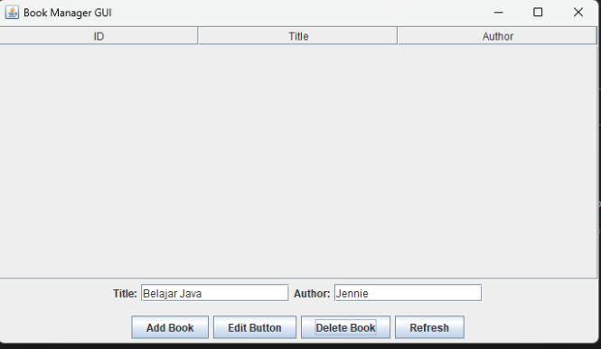

